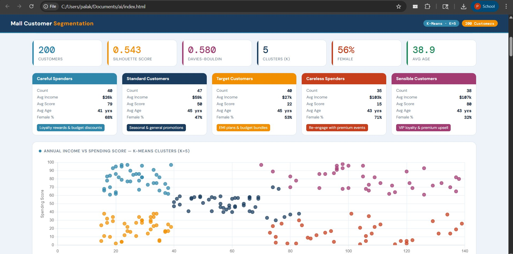

# Mall Customer Segmentation — AI Internal Assessment 3

<p align="center">
  
</p>

<p align="center">
  
  
  
  
  
  
</p>

---

## About the Project

This is the **Third Internal Assessment (IA3)** for the subject **Artificial Intelligence** at **K.J. Somaiya School of Engineering, Mumbai — Semester VI**.

We applied **K-Means Clustering** (K=5) to the [Kaggle Mall Customer Segmentation Dataset](https://www.kaggle.com/datasets/vjchoudhary7/customer-segmentation-tutorial-in-python) to group 200 mall customers into 5 meaningful segments based on their **Annual Income** and **Spending Score**.

The project ships in **two versions** — a Python desktop script and a fully browser-based web dashboard — both producing identical results from the same dataset.

---
## Group Members

| Name | Roll Number |
|---|---|
| Palak Chandak | 16010123226 |
| Palak Nagar | 16010123227 |
| Muskan Shaikh | 16010123208 |
| Manasi Patil | 16010123188 |

**Institution:** K.J. Somaiya School of Engineering, Mumbai  
**Semester:** VI &nbsp;|&nbsp; **Subject:** Artificial Intelligence &nbsp;|&nbsp; **Assessment:** IA3

---

## Project Structure

```
AI_IA3/
│
├── web-version/
│   └── index.html                  # Self-contained web dashboard
│                                     All clustering, charts & explainer in one file
│
├── desktop-version/
│   ├── Mall_Customers.csv          # Raw dataset (200 rows, 4 features)
│   ├── customer_segmentation.py    # Python K-Means script
│   ├── requirements.txt            # Python dependencies
│   └── Outputs/                    # Generated plots & results saved here
│
├── dashboard_preview.png           # Screenshot of the web dashboard
└── README.md                       # This file
```

---

## Two Versions Explained

### 🌐 Web Version — `web-version/index.html`

A fully self-contained interactive dashboard that runs **entirely in the browser**. No Python, no server, no install required.

**What it does:**
- Embeds all 200 customer records directly as a JavaScript array (`RAW`)
- Runs K-Means clustering (K=5) live in the browser using pure JavaScript
- Computes Silhouette Score and Davies-Bouldin Index in-browser
- Renders 6 charts via Chart.js: scatter plot, gender donut, age/income/score histograms, cluster profile bars
- Shows a full 200-row data table with cluster colour labels
- Includes a step-by-step **"How We Treated the Data"** section explaining every data transformation visually

**How to run:**
```
Just open web-version/index.html in any browser. That's it.
```

**Libraries used (CDN — no install):**

| Library | Version | Purpose |
|---|---|---|
| Chart.js | 4.4.1 | All charts (scatter, bar, donut) |
| DM Sans / DM Mono | — | Typography via Google Fonts |

---

### 🖥️ Desktop Version — `desktop-version/`

A Python script that reads the CSV, runs K-Means via scikit-learn, and saves output plots to the `Outputs/` folder.

**Files:**

| File | What it does |
|---|---|
| `Mall_Customers.csv` | Raw Kaggle dataset — 200 rows, columns: CustomerID, Gender, Age, Annual Income (k$), Spending Score |
| `customer_segmentation.py` | Main script: loads CSV → preprocesses → runs K-Means (K=5) → computes metrics → saves plots to `Outputs/` |
| `requirements.txt` | Lists all Python dependencies needed to run the script |
| `Outputs/` | Folder where generated charts and results are written after running the script |

**How to run:**
```bash
# 1. Clone the repo
git clone https://github.com/palakchandak8/AI_IA3.git
cd AI_IA3/desktop-version

# 2. Install dependencies
pip install -r requirements.txt

# 3. Run the script
python customer_segmentation.py
# → Plots and results are saved to the Outputs/ folder
```

**Dependencies (requirements.txt):**
```
pandas
numpy
scikit-learn
matplotlib
seaborn
```

---

## Dataset

| Field | Detail |
|---|---|
| **Source** | Kaggle — Mall Customer Segmentation Dataset |
| **Author** | Choudhary, V. (2019) |
| **Rows** | 200 customers |
| **Features** | CustomerID, Gender, Age, Annual Income (k$), Spending Score (1–100) |
| **Link** | [kaggle.com/vjchoudhary7](https://www.kaggle.com/datasets/vjchoudhary7/customer-segmentation-tutorial-in-python) |

---

## How We Treated the Data

Both versions follow the same pipeline:

```
Raw CSV / JS Array
       ↓
  Select features: Annual Income & Spending Score
       ↓
  Z-Score Normalisation  →  mean ≈ 0, std ≈ 1  (equal scale for K-Means distance)
       ↓
  K-Means Clustering  K=5  (15 random initialisations → best inertia kept)
       ↓
  Quadrant remapping  →  stable semantic cluster IDs across runs
       ↓
  Metrics: Silhouette Score + Davies-Bouldin Index
       ↓
  Charts, Segment Cards & Data Table
```

### Normalisation — why it matters
Income ranges 15–137 k$ and Score ranges 1–99. Without normalisation, income values are numerically larger and would dominate the Euclidean distance calculation — making clusters based on income scale, not meaning. Z-score normalisation fixes this:

```python
# Python (desktop version) — sklearn handles this
from sklearn.preprocessing import StandardScaler
scaler = StandardScaler()
X_scaled = scaler.fit_transform(X)   # X = [[income, score], ...]
```

```js
// JavaScript (web version) — implemented from scratch
function normalize(arr) {
  const mean = arr.reduce((a, b) => a + b, 0) / arr.length;
  const std  = Math.sqrt(arr.reduce((a, b) => a + (b - mean) ** 2, 0) / arr.length) || 1;
  return arr.map(v => (v - mean) / std);
}
const incS = normalize(RAW.map(r => r[2]));  // income column
const scS  = normalize(RAW.map(r => r[3]));  // score column
```

### Cluster Stability (Web Version only)
Since JavaScript K-Means uses random initialisation, cluster IDs could shift between page loads. The web version remaps each cluster to a fixed semantic quadrant (low/high income × low/high spend) based on centroid position — so the same cluster always has the same name and colour.

---

## Customer Segments

| # | Cluster Name | Avg Income | Avg Score | Key Trait | Marketing Strategy |
|---|---|---|---|---|---|
| C0 | **Careful Spenders** | Low (~$26k) | High (79) | Budget-conscious but highly engaged | Loyalty rewards & budget discounts |
| C1 | **Standard Customers** | Mid (~$59k) | Mid (50) | Average across all metrics | Seasonal & general promotions |
| C2 | **Target Customers** | Low (~$27k) | Low (22) | Low income, low engagement | EMI plans & budget bundles |
| C3 | **Careless Spenders** | High (~$103k) | Low (15) | High earners who don't engage | Re-engage with premium events |
| C4 | **Sensible Customers** | High (~$107k) | High (80) | High income, high engagement | VIP loyalty & premium upsell |

---

## Cluster Quality Metrics

| Metric | Score | Interpretation |
|---|---|---|
| **Silhouette Score** | ~0.543 | Good separation between clusters (range −1 to 1, higher = better) |
| **Davies-Bouldin Index** | ~0.580 | Compact and well-separated clusters (lower = better) |

---


## References

- Choudhary, V. (2019). *Mall Customer Segmentation Data*. Kaggle.  
  https://www.kaggle.com/datasets/vjchoudhary7/customer-segmentation-tutorial-in-python  
- MacQueen, J. (1967). Some methods for classification and analysis of multivariate observations. *Proceedings of the Fifth Berkeley Symposium on Mathematical Statistics and Probability*.  
- Pedregosa et al. (2011). Scikit-learn: Machine Learning in Python. *JMLR 12*, pp. 2825–2830.  
- Chart.js Documentation. https://www.chartjs.org/docs/
